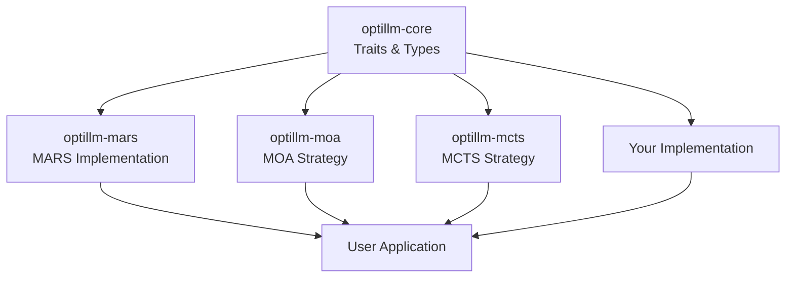
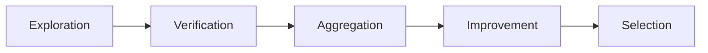

# Architecture Overview

## System Design

optillm-rs is built on a modular, trait-based architecture that enables flexible composition of optimization techniques.

## Core Principles

### 1. Trait-Based Design
All optimization strategies implement core traits from `optillm-core`:
- `ModelClient`: LLM communication interface
- `Optimizer`: Optimization algorithm interface

### 2. Separation of Concerns
- **Core**: Traits and types
- **Implementations**: Specific optimization strategies (MARS, MOA, etc.)
- **Consumers**: Applications using the optimizers

### 3. Async-First
All I/O operations are async using `tokio` and streaming patterns.

### 4. Type Safety
Strong typing throughout, leveraging Rust's type system for correctness.

### 5. Extensibility
Easy to add new optimization techniques without modifying existing code.

## Crate Structure



## Component Interaction

### ModelClient Trait

```rust
pub trait ModelClient {
    fn stream(&self, prompt: &Prompt)
        -> Pin<Box<dyn Stream<Item = Result<ResponseEvent, OptillmError>> + Send>>;
}
```

**Responsibility**: Abstract away LLM provider details

### Optimizer Trait

```rust
pub trait Optimizer {
    async fn optimize(
        &self,
        query: &str,
        client: &dyn ModelClient,
    ) -> Result<Solution>;

    fn name(&self) -> &str;
    fn description(&self) -> &str;
}
```

**Responsibility**: Implement optimization strategy

## MARS Architecture

MARS (Multi-Agent Reasoning System) implements a 5-phase workflow:



### Phase 1: Exploration
- Multiple agents explore solution space in parallel
- Different temperatures encourage diversity
- Each agent generates candidate solutions

### Phase 2: Verification
- Cross-agent verification with consensus scoring
- Solutions evaluated for correctness and quality
- Confidence scores assigned

### Phase 3: Aggregation
- Multiple aggregation strategies:
  - RSA (Reasoning-aware Synthesis)
  - Majority voting
  - Mixture of Experts
- Synthesize best aspects of multiple solutions

### Phase 4: Improvement
- Iterative refinement based on feedback
- Strategy extraction and learning
- Pattern identification for future use

### Phase 5: Selection
- Final answer selection from improved solutions
- Quality metrics and confidence assessment
- Result packaging with metadata

## Data Flow

```
Query
  ↓
[Agent Pool] → Solutions
  ↓
[Verifier] → Verified Solutions
  ↓
[Aggregator] → Synthesized Solution
  ↓
[Improver] → Refined Solution
  ↓
[Selector] → Final Answer
```

## Key Types

### Solution
```rust
pub struct Solution {
    pub id: String,
    pub agent_id: String,
    pub reasoning: String,
    pub answer: String,
    pub temperature: f32,
    pub token_count: usize,
    pub verification_score: f32,
    pub is_verified: bool,
    // ... more fields
}
```

### MarsEvent
```rust
pub enum MarsEvent {
    ExplorationStarted { num_agents: usize },
    SolutionGenerated { solution_id: String, agent_id: String },
    VerificationStarted,
    SolutionVerified { solution_id: String, is_correct: bool, score: f32 },
    // ... more events
}
```

## Error Handling

The system uses a hierarchical error type:

```rust
pub enum MarsError {
    ExplorationError(String),
    VerificationError(String),
    AggregationError(String),
    // ... more variants
}
```

## Extensibility Points

### Adding New Optimizer

Implement the `Optimizer` trait:

```rust
pub struct MyOptimizer;

#[async_trait]
impl Optimizer for MyOptimizer {
    async fn optimize(&self, query: &str, client: &dyn ModelClient)
        -> Result<Solution> {
        // Your implementation
    }

    fn name(&self) -> &str { "my-optimizer" }
    fn description(&self) -> &str { "..." }
}
```

### Adding New ModelClient

Implement the `ModelClient` trait:

```rust
pub struct MyLLMClient;

impl ModelClient for MyLLMClient {
    fn stream(&self, prompt: &Prompt)
        -> Pin<Box<dyn Stream<Item = Result<ResponseEvent, OptillmError>> + Send>> {
        // Your streaming implementation
    }
}
```

### Adding New Aggregation Strategy

Extend `AggregationMethod` enum and implement in aggregator:

```rust
pub enum AggregationMethod {
    // ... existing
    MyStrategy,
}
```

## Performance Considerations

### Concurrency
- Agent exploration happens in parallel
- Uses `tokio` for efficient async execution
- Proper resource pooling for LLM API calls

### Caching
- Strategy network enables knowledge reuse
- Solution workspace for efficient storage
- Token usage tracking for cost optimization

### Streaming
- Response streaming reduces memory pressure
- Real-time event emission for progress tracking
- Incremental result processing

## Testing Strategy

### Unit Tests
- Individual component testing
- Trait implementation validation

### Integration Tests
- Full optimization workflow
- Multi-component interaction

### Benchmarks
- Performance measurement
- Token efficiency tracking

## Design Patterns

### Pattern 1: Trait Objects for Flexibility
Uses trait objects (`&dyn ModelClient`) to abstract implementation details.

### Pattern 2: Streaming for Efficiency
Streams responses rather than loading full responses in memory.

### Pattern 3: Event-Driven Architecture
Emits events for monitoring and progress tracking.

### Pattern 4: Configuration Objects
Centralized configuration with sensible defaults.

### Pattern 5: Type-Safe Builders
Fluent builders for complex object construction.

## Future Extensions

Planned architectural improvements:

- Plugin system for dynamic strategy loading
- Distributed execution across multiple nodes
- Advanced caching with persistent storage
- Hardware acceleration support
